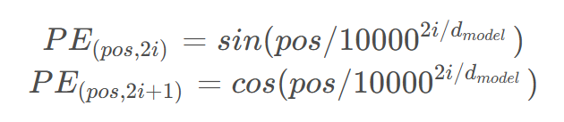

# Transformer 复现笔记
论文翻译参考： https://zhuanlan.zhihu.com/p/703292893

论文地址： https://dl.acm.org/doi/pdf/10.5555/3295222.3295349

代码参考： https://blog.csdn.net/nocml/article/details/110920221
## 位置编码器 PositionalEncoding

最终得到的 **PE** 是一个 `(max_length, d_model)` 的张量。

### 公式



### 实现步骤

**1. 分母部分计算：**

几种实现方式：

* **方法1（常见写法）：**

```python
div_term = torch.exp(torch.arange(0, d_model, 2).float()
                     * -(math.log(10000.0) / d_model))
```

* **方法2（逐个 pow）：**

```python
div_term = torch.pow(10000, -torch.arange(0, d_model, 2).float() / d_model)
```

* **方法3（推荐，向量化）：**

```python
div_term = 10000 ** (-torch.arange(0, d_model, 2).float() / d_model)
```

---

**2. 正余弦计算：**

```python
pe[:, 0::2] = torch.sin(position * div_term)  # 偶数位置
pe[:, 1::2] = torch.cos(position * div_term)  # 奇数位置
```

---

**3. register\_buffer**

```python
self.register_buffer("pe", pe)
```

* 让 `pe` 随 `.to(device)` 自动迁移
* 不会作为可训练参数更新

---
