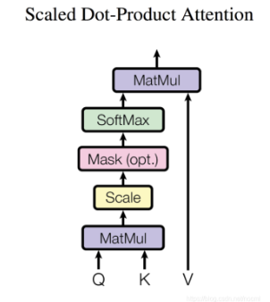

# Transformer 复现笔记
论文翻译参考： https://zhuanlan.zhihu.com/p/703292893

论文地址： https://dl.acm.org/doi/pdf/10.5555/3295222.3295349

代码参考： https://blog.csdn.net/nocml/article/details/110920221

## 位置编码器 PositionalEncoding

最终得到的 **PE** 是一个 `(max_length, d_model)` 的张量。

### 公式


### 实现步骤

**1. 分母部分计算：**

几种实现方式：

* **方法1（常见写法）：**

```python
div_term = torch.exp(torch.arange(0, d_model, 2).float()
                     * -(math.log(10000.0) / d_model))
```

* **方法2（逐个 pow）：**

```python
div_term = torch.pow(10000, -torch.arange(0, d_model, 2).float() / d_model)
```

* **方法3（推荐，向量化）：**

```python
div_term = 10000 ** (-torch.arange(0, d_model, 2).float() / d_model)
```

---

**2. 正余弦计算：**

```python
pe[:, 0::2] = torch.sin(position * div_term)  # 偶数位置
pe[:, 1::2] = torch.cos(position * div_term)  # 奇数位置
```

---

**3. register\_buffer**

```python
self.register_buffer("pe", pe)
```

* 让 `pe` 随 `.to(device)` 自动迁移
* 不会作为可训练参数更新

---
好的 👍 我帮你把这一节的 README 文件排版和润色，增强逻辑性和可读性：

---

## 🔹 Scaled Dot-Product Attention

**点积注意力（Dot-Product Attention）** 是最常用的注意力机制，其核心思想是通过 **Q（Query）、K（Key）、V（Value）** 的计算来获得注意力分布。

计算流程如下：

```
Q × Kᵀ → 缩放 (scale) → 掩码 (mask) → Softmax → 与 V 相乘
```



---

### 📌 关键步骤说明

1. **点积 (Q × Kᵀ)**

   * 先将 `K` 进行转置（transpose），保证矩阵维度匹配。
   * 点积结果代表 Query 与 Key 的相似度。

2. **缩放 (Scaling)**

   * 由于向量维度较大时，点积数值可能过大，导致 Softmax 的梯度变得极小，训练困难。
   * 因此需要除以 `√d_k`（Key 向量维度），起到“归一化/正则化”的作用，避免梯度消失。

3. **掩码 (Masking)**

   * 在计算注意力时，某些位置（如填充的 padding 部分）是不应参与计算的。
   * 通过将这些无效位置的分数替换为一个极小值（如 `-1e9`），使其在 Softmax 后接近于 0。

4. **Softmax**

   * 将注意力分数转换为概率分布，突出相关性强的 Key，抑制不相关的 Key。

5. **加权求和 (与 V 相乘)**

   * 将 Softmax 得到的注意力权重应用到 Value 上，得到最终的注意力输出。

---

### ✨ 总结

* **Scaled Dot-Product Attention** 本质上就是在 Query 与 Key 的相似度计算后，通过 **缩放 + 掩码 + Softmax** 来得到权重，再加权 Value。
* 它是 **Transformer 架构的核心组件**，也是后续 Multi-Head Attention 的基础。

---
 

