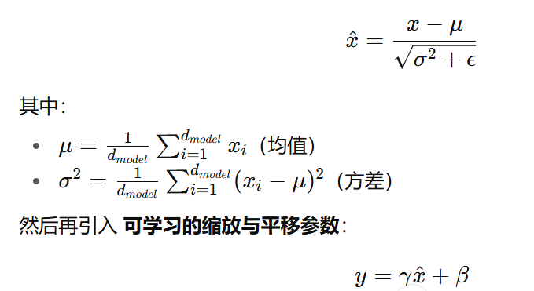

---

# Transformer 复现笔记

论文翻译参考： [https://zhuanlan.zhihu.com/p/703292893](https://zhuanlan.zhihu.com/p/703292893)

论文地址： [https://dl.acm.org/doi/pdf/10.5555/3295222.3295349](https://dl.acm.org/doi/pdf/10.5555/3295222.3295349)

代码参考： [https://blog.csdn.net/nocml/article/details/110920221](https://blog.csdn.net/nocml/article/details/110920221)

---

## 位置编码器 PositionalEncoding

最终得到的 **PE** 是一个 `(max_length, d_model)` 的张量。

### 公式


### 实现步骤

**1. 分母部分计算：**

几种实现方式：

* **方法1（常见写法）：**

```python
div_term = torch.exp(torch.arange(0, d_model, 2).float()
                     * -(math.log(10000.0) / d_model))
```

* **方法2（逐个 pow）：**

```python
div_term = torch.pow(10000, -torch.arange(0, d_model, 2).float() / d_model)
```

* **方法3（推荐，向量化）：**

```python
div_term = 10000 ** (-torch.arange(0, d_model, 2).float() / d_model)
```

---

**2. 正余弦计算：**

```python
pe[:, 0::2] = torch.sin(position * div_term)  # 偶数位置
pe[:, 1::2] = torch.cos(position * div_term)  # 奇数位置
```

---

**3. register\_buffer**

```python
self.register_buffer("pe", pe)
```

* 让 `pe` 随 `.to(device)` 自动迁移
* 不会作为可训练参数更新

---

## 🔹 Scaled Dot-Product Attention

**点积注意力（Dot-Product Attention）** 是最常用的注意力机制，其核心思想是通过 **Q（Query）、K（Key）、V（Value）** 的计算来获得注意力分布。

计算流程如下：

```
Q × Kᵀ → 缩放 (scale) → 掩码 (mask) → Softmax → 与 V 相乘
```


---

### 📌 关键步骤说明

1. **点积 (Q × Kᵀ)**

   * `K` 转置后再与 `Q` 点积，结果表示相似度。

2. **缩放 (Scaling)**

   * 除以 `√d_k` 避免数值过大，减缓梯度消失问题。

3. **掩码 (Masking)**

   * 将 padding 或未来时刻的分数置为 `-1e9`，使其在 Softmax 后趋近 0。

4. **Softmax**

   * 将分数归一化为概率分布。

5. **加权求和**

   * 使用 Softmax 权重对 `V` 加权，得到注意力输出。

---

### ✨ 总结

* **Scaled Dot-Product Attention** 是 Transformer 的核心操作。
* 它通过 **缩放 + 掩码 + Softmax** 得到权重，再与 `V` 相乘。
* Multi-Head Attention 正是基于该机制的扩展。

---

## 🔹 Multi-Head Attention

多头注意力通过 **并行多组 Q/K/V 投影**，让模型在不同子空间上同时学习注意力表示。

### 📌 学习过程中的常见错误与缺漏

1. **Linear 层参数设置错误**

   * 错误：以为 `nn.Linear` 不需要指定输入/输出维度。
   * 修正：输入是 `[batch, seq_len, d_model]`，因此 `nn.Linear(d_model, d_model)`。

2. **忘记拆分多头**

   * 错误：直接对 `Q/K/V` 做注意力计算。
   * 修正：必须 `view(nbatches, seq_len, h, d_k)` 再 `transpose(1,2)` → `[batch, h, seq_len, d_k]`。

3. **mask 维度处理错误**

   * 错误：mask 与 `scores` 不对齐，导致 `RuntimeError`。
   * 修正：mask 需要 `unsqueeze(1)` 变成 `[batch, 1, 1, seq_len]`。

4. **参数共享问题**

   * 错误：使用 `[nn.Linear()] * 4`，导致 Q/K/V 共享参数。
   * 修正：必须 `nn.ModuleList([nn.Linear(...) for _ in range(4)])`，或用 `copy.deepcopy`。

5. **attention 中缺少缩放**

   * 错误：有时忘记除以 `√d_k`。
   * 修正：`scores = torch.matmul(Q, Kᵀ) / math.sqrt(d_k)`。

6. **拼接多头时忘记 contiguous**

   * 错误：直接 reshape 可能报错或顺序错误。
   * 修正：`x.transpose(1,2).contiguous().view(batch, seq_len, d_model)`。

---

### ✅ 代码逻辑梳理

1. `Linear` 投影得到 Q/K/V。
2. reshape & transpose → `[batch, h, seq_len, d_k]`。
3. 计算 **Scaled Dot-Product Attention**。
4. 拼接多头输出 → `[batch, seq_len, d_model]`。
5. 通过最后一个 `Linear` 投影，保持输出维度一致。

---

### ✨ 总结

* **错误主要集中在维度处理、mask 广播、Linear 参数共享**。
* 多头注意力的核心是：

  ```
  Linear → 拆分多头 → Attention → 拼接多头 → Linear
  ```
* 保证每个步骤维度正确，才能实现稳定的 Transformer 复现。

---

## 🔹 Layer Normalization (LN)

**Layer Normalization** 与 **Batch Normalization** 类似，都是对输入进行归一化，使模型训练更稳定。不同点在于：

* **BatchNorm**：对 batch 维度统计均值和方差，依赖于 batch size。
* **LayerNorm**：对每个样本的 **特征维度**（如 `d_model`）统计均值和方差，不依赖 batch size。

因此，Transformer 中更适合使用 **LayerNorm**，因为 NLP 任务常常 batch size 较小，而 LN 与 batch size 无关。

---

### 📌 公式

对输入张量 `x ∈ R^(batch, seq_len, d_model)`，在最后一维 `d_model` 上做归一化：


---

### 📌 代码实现注意点

1. **均值和方差计算**

   ```python
   mean = x.mean(dim=-1, keepdim=True)
   var = x.var(dim=-1, keepdim=True, unbiased=False)
   std = torch.sqrt(var + self.eps)
   ```

   * 必须 `keepdim=True`，保证形状可广播。
   * `unbiased=False`，除以 `N`，避免小 batch 时数值不稳定。

2. **gamma 和 beta 的形状**

   ```python
   self.gamma = nn.Parameter(torch.ones(features))
   self.beta = nn.Parameter(torch.zeros(features))
   ```

   * 只需一维 `[features]`，PyTorch 广播机制会自动扩展到 `[batch, seq_len, d_model]`。

3. **forward 逻辑**

   ```python
   return self.gamma * (x - mean) / std + self.beta
   ```

---

### ✅ 代码示例

```python
class LayerNormalization(nn.Module):
    def __init__(self, features, eps=1e-6):
        super(LayerNormalization, self).__init__()
        self.gamma = nn.Parameter(torch.ones(features))
        self.beta = nn.Parameter(torch.zeros(features))
        self.eps = eps

    def forward(self, x: torch.Tensor) -> torch.Tensor:
        mean = x.mean(dim=-1, keepdim=True)
        var = x.var(dim=-1, keepdim=True, unbiased=False)
        std = torch.sqrt(var + self.eps)
        return self.gamma * (x - mean) / std + self.beta
```

---

### ✨ 总结

* **LN 与 BN 的区别**：LN 不依赖 batch size，更适合 Transformer。
* **实现要点**：

  * 在最后一维上求均值和方差。
  * 使用 `unbiased=False` 避免小样本不稳定。
  * 参数 `gamma`、`beta` 通过广播自动扩展。
* LN 的核心思想就是 **对每个样本的 embedding 向量做归一化，再通过可学习参数调整分布**。

---

# 🔹 Position-wise Feed-Forward Networks (FFN)

**前馈神经网络（Feed Forward Network, FFN）** 是 Transformer 中的 **模块5**。
它本质上就是一个 **两层的多层感知机（MLP）**，作用是对序列中的每个位置单独进行非线性变换。

---

## 📌 模块逻辑

1. **输入输出维度一致**

   * 输入维度：`d_model`
   * 输出维度：`d_model`
   * 这样才能和残差连接保持一致。

2. **中间升维**

   * 先从 `d_model → d_ff`（一般 2048）。
   * 再从 `d_ff → d_model`（还原回输入维度）。
   * 这种 **升维再降维** 的方式，让模型具备更强的非线性表达能力。

3. **逐位置独立**

   * FFN 会对序列中的每个位置 **独立应用相同的两层 MLP**。
   * 不会在不同位置之间交互 → 交互由 **Attention** 来完成。

---

## 📌 学习过程中的常见错误与注意点

1. **Linear 输入输出维度搞反**

   * 错误：写成 `nn.Linear(d_ff, d_model)`。
   * 修正：应先 `d_model → d_ff`，再 `d_ff → d_model`。

2. **忘记加激活函数**

   * 如果没有 `ReLU/GELU`，模型退化为两层线性层，等效于一层。

3. **丢掉 Dropout**

   * 容易过拟合，Transformer 原论文里默认在第一层后加 Dropout。

4. **和 CNN 的关系**

   * FFN 可以看作 **两个卷积核大小为 1 的卷积**，本质等价于逐位置的全连接层。

---

## ✨ 总结

* FFN 是 Transformer 中的 **位置独立 MLP**。
* 结构：

  ```
  Linear(d_model → d_ff) → ReLU → Dropout → Linear(d_ff → d_model)
  ```
* 意义：

  * **Attention** 负责位置之间的信息交互。
  * **FFN** 负责逐位置的非线性特征变换。
* 注意事项：

  * Linear 维度要正确。
  * 激活函数和 Dropout 不能漏。

---

## 🔹 代码封装

在完整的 Transformer 编码器与解码器结构中，通常会将子层进行进一步的封装，以简化代码与结构表达。

### Block 1：Multi-Head Attention + Add & Norm

* **组成部分**：多头注意力机制（MHA）、残差连接（Add）、层归一化（LayerNorm）
* **作用**：

  1. 通过多头注意力机制捕获序列内部的全局依赖关系。
  2. 使用残差连接解决梯度消失和模型退化问题。
  3. 层归一化保证数值稳定，加速训练收敛。
* **输入输出**：输入为 `[batch, seq_len, d_model]`，输出维度保持不变。

---

### Block 2：Feed Forward Network + Add & Norm

* **组成部分**：前馈神经网络（FFN）、残差连接（Add）、层归一化（LayerNorm）
* **作用**：

  1. 通过两层全连接 + ReLU 引入非线性变换，提升表示能力。
  2. 残差连接让网络在深层依然能有效传播信息。
  3. 层归一化保持稳定性，避免数值过大或过小。
* **输入输出**：输入为 `[batch, seq_len, d_model]`，输出维度保持不变。

---

### EncoderLayer（编码器层）

* **结构**：Block1 → Block2
* **作用**：先通过注意力建模序列的依赖关系，再通过前馈网络提升特征表达。

---

### DecoderLayer（解码器层）

* **结构**：Block1（Masked Self-Attention） → Block1（Encoder-Decoder Attention） → Block2
* **作用**：

  1. **Masked Self-Attention**：保证解码时只利用已生成的序列，防止信息泄露。
  2. **Encoder-Decoder Attention**：将编码器的输出作为 memory，帮助解码器获取源序列信息。
  3. **Feed Forward Network**：进一步增强特征的非线性表达。

---

📌 **总结**：
通过对 MHA、FFN、Add & Norm 的合理封装，我们可以更清晰地搭建 Transformer 编码器和解码器层，同时保证代码复用性与可读性。

---


